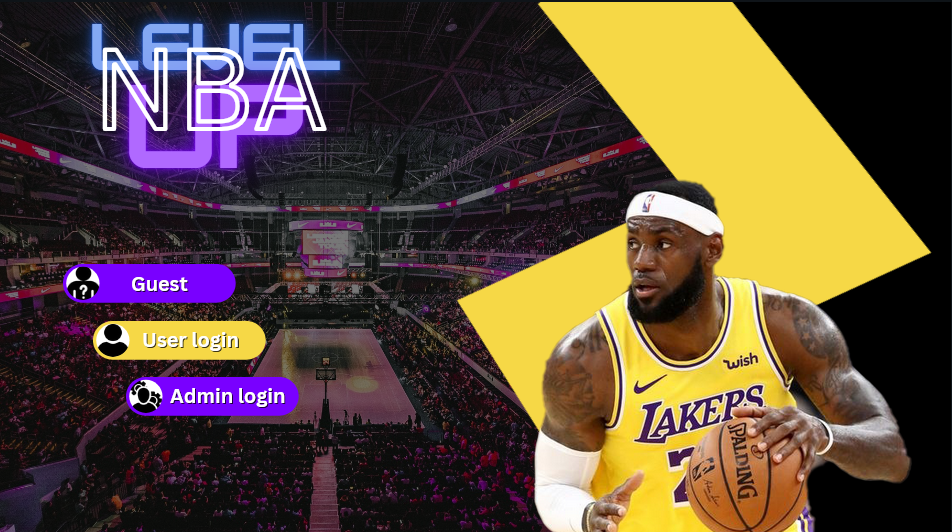
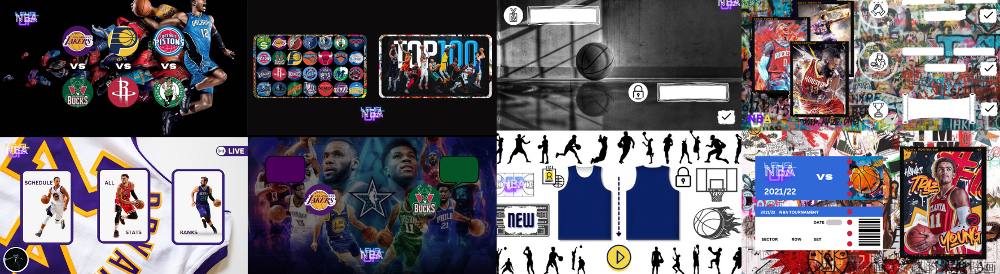

🏀 LEVEL UP – Desktop Application for NBA Stats and Live Match Tracking

LEVEL UP is a Java-based desktop application designed to provide users with access to NBA-related content such as team/player statistics, match schedules, live scores, and ticket booking. The application supports multiple user roles with increasing privileges, including Guest, User, and Admin. It was developed as part of a structured software engineering process including case studies, a Gantt chart, user goals, functional/non-functional requirements, and class diagrams.

🎯 Project Goals

    Team creation and management

    Player registration and management

    Championship creation and automatic draw of match fixtures

    Live score display and statistics tracking

👤 User Roles and Permissions

The application classifies users into three categories:
🟡 Guest

    Access: No login required

    Capabilities:

        View game schedule (home team, away team, date, match status)

        View team statistics:

            Team name

            Match record

            Win probability

            PTS, FGM, 3PM, FTM, REB, AST

        View player statistics:

            Rank

            Player name

            Team

            Shot percentage

            Total baskets

            Games played

        View team standings by category

        Watch live scores of current matches

        Browse match days of existing tournaments

🔵 User

    Access: Login/registration required

    Capabilities:

        All Guest features

        Ticket booking:

            Select a match

            Generate a ticket through a dedicated panel

🔴 Admin

    Access: Login required

    Capabilities:

        All User features

        Admin Panel:

            Add/edit teams:

                Team name

                Home city

                Acronym (must be unique)

            Add/edit players:

                Player name

                Position (from a predefined set)

                Assign to a valid team (must exist)

            Championship setup:

                Launch tournament draw

                Ensure even number of teams before creation

            Input validation to avoid:

                Duplicate team names or acronyms

                Duplicate player names

                Invalid or unregistered teams/positions

🧠 Application Features

    Role-based Interface: UI adapts based on selected role (Guest, User, Admin)

    Live Scores: Real-time display of current NBA matches

    Statistics: Visual and text-based team/player performance metrics

    Ticketing: In-app ticket generation for Users

    Data Management: Admin control for creating/modifying teams, players, and match fixtures

📁 Project Structure (Class Overview)
Class/File	Description
start.java	Main entry point of the application
categ.java	Handles user role selection
userlog.java, adminlog.java, newUser.java	User and Admin login/registration
seeNewTeamsPlayers.java, NewTeamsPlayers.java	Viewing newly created teams and players
Ranks.java, TeamsStats.java, PlayerStats.java	Logic and display for statistics
livecho.java, livese.java, livematc.java, livethird.java	Live score components
ticket.java	Ticket booking system
adminCho.java	Admin panel for data input
StatsCho.java	Statistics panel
sched.java	Championship schedule display
Vs.java	Match comparison/preview UI
NBA.java	General NBA-related configuration or enums
CustomOutputStream.java	Custom system output handling (likely for GUI logs)
📊 Methodology

The project follows a structured software engineering process including:

    Case Studies

    Gantt Diagram for planning

    Functional & Non-functional Requirements

    User Goals & Role Matrix

    UML Class Diagrams

🧾 Requirements

    Java Runtime Environment (JRE)

    Java Development Kit (JDK) 8+

    Java Swing (used for GUI)

    Desktop operating system (Windows/macOS/Linux)

🔐 Notes

    All users, regardless of role, can log out or navigate back at any time.

    Role-based access ensures controlled feature exposure.

    The Admin is expected to input consistent and accurate data manually, as location validation is considered beyond project scope.

